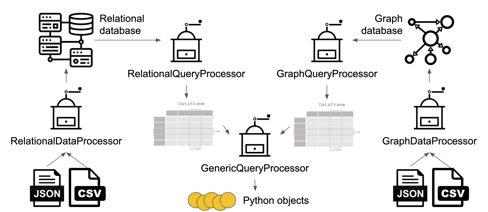
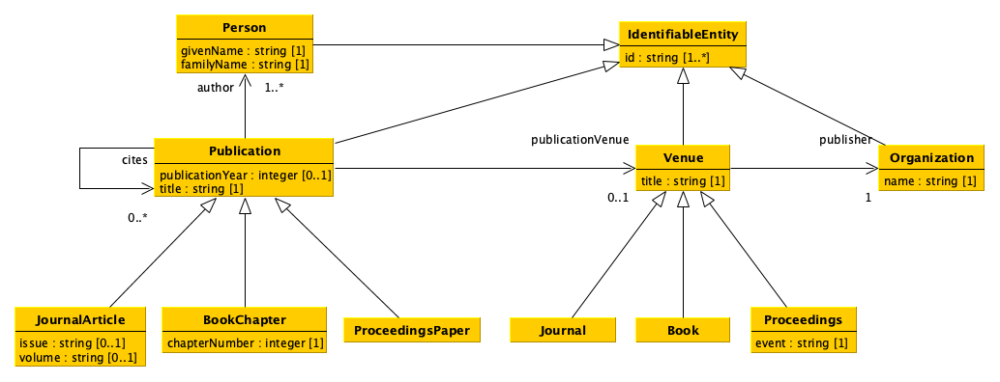
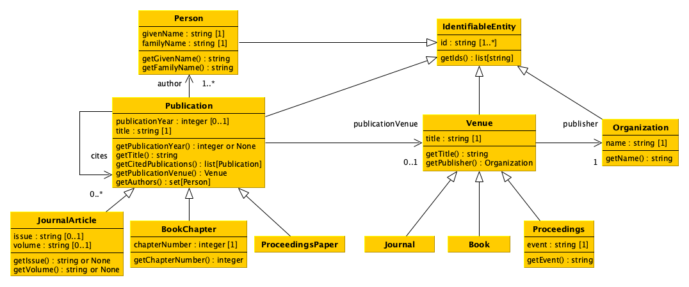
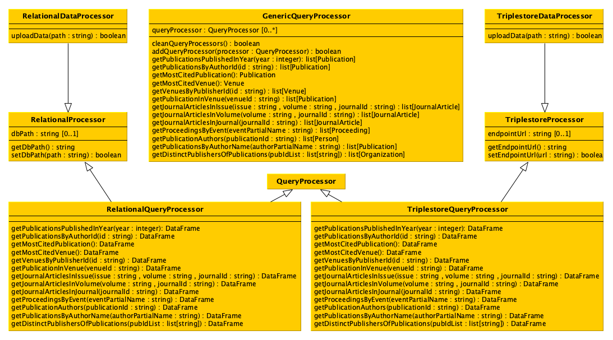

# Data Science: project

The goal of the project is to develop a software that enables one to process data stored in different formats and to upload them into two distinct databases
to query these databases simultaneously according to predefined operations. The software must be accompanied by a document (i.e. a Jupyter notebook) describing the data to process (their main characteristics and possible issues) and how the software has been organised (name of the files, where have been defined the various Python classes, etc.).

## Workflow

## Data model

## UML of data model classes

## UML of additional classes

